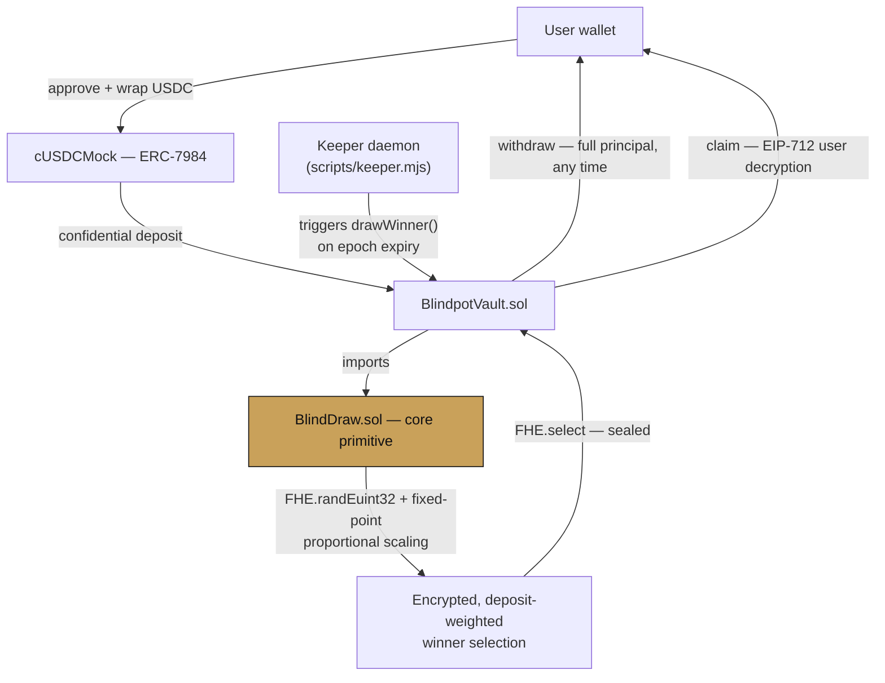

# Blindpot

> **Confidential, no-loss prize savings on the Zama fhEVM.**  
> *Built for the Zama Developer Program — Mainnet Season 4, Bounty Track.*

---

## Table of contents

- [The problem](#the-problem)
- [The solution](#the-solution)
- [Live deployment](#live-deployment)
- [Architecture](#architecture)
- [How the confidential draw works](#how-the-confidential-draw-works)
- [Confidentiality design — what's encrypted, what's public](#confidentiality-design--whats-encrypted-whats-public)
- [Trust model](#trust-model)
- [Tech stack](#tech-stack)
- [Quickstart](#quickstart)
- [Roadmap](#roadmap)
- [Security](#security)

---

## The problem

Prize-linked savings — pool deposits, award the pooled yield to one random depositor, return everyone's principal in full — is a real, proven savings mechanism. Products built on exactly this pattern already run at national scale: UK Premium Bonds, US credit-union "Save to Win" accounts. A probabilistic upside gets people who won't respond to plain interest to actually save consistently, with zero principal risk.

On-chain versions of this exist — PoolTogether being the best known — but they run on transparent ledgers, which means every deposit is public. Not "someone deposited," but exactly how much, from which address, updated in real time. That's not a hypothetical privacy concern; it's the literal current state of the product. It exposes individual depositors' wealth, lets anyone copy or front-run large depositors' behavior, and — more consequentially — it locks the entire mechanism out of institutional use. No credit union, fintech, or DAO treasury will run its balance sheet through a system where the exact number is posted publicly for competitors to read.

---

## The solution

Blindpot rebuilds the same mechanic with deposits, balances, and winnings encrypted on-chain from the moment they land, using Zama's fhEVM. Not hidden by a frontend — actually encrypted in contract storage, computed on directly via fully homomorphic encryption, so no observer (including this app) can read an individual balance. 

Winner selection runs entirely over encrypted balances, weighted by deposit size, using on-chain FHE randomness. Principal is withdrawable in full, at any time, no lock, no fee — that guarantee doesn't bend for any reason.

---

## Live deployment

| Parameter | Value |
| :--- | :--- |
| **Network** | Ethereum Sepolia (Chain ID `11155111`) |
| **`BlindpotVault`** | [`0xe936872f7558fd545bfc072fcf9f321c8d5965c4`](https://sepolia.etherscan.io/address/0xe936872f7558fd545bfc072fcf9f321c8d5965c4) |
| **`cUSDCMock` (ERC-7984)** | [`0x7c5BF43B851c1dff1a4feE8dB225b87f2C223639`](https://sepolia.etherscan.io/address/0x7c5BF43B851c1dff1a4feE8dB225b87f2C223639) |
| **`Underlying USDC` (ERC-20)** | [`0x9b5Cd13b8eFbB58Dc25A05CF411D8056058aDFfF`](https://sepolia.etherscan.io/address/0x9b5Cd13b8eFbB58Dc25A05CF411D8056058aDFfF) |

*Test tokens are available from the in-app faucet (`/faucet`) — no external dependency, no other chain's testnet USDC required.*

---

## Architecture

`BlindDraw.sol` is deliberately decoupled from vault logic — it's the reusable primitive (confidential, deposit-weighted random selection over a bounded encrypted set), importable by any future Zama builder who needs the same capability for a raffle, reward distribution, or airdrop, without inheriting Blindpot's savings-specific vault code.



### Repo structure

```text
contracts/
├── src/
│   ├── BlindDraw.sol               # Reusable confidential weighted-selection primitive
│   └── vaults/BlindpotVault.sol   # Deposit / withdraw / claim / epoch draw
└── test/
    ├── BlindDraw.t.sol
    └── HCUBenchmark.t.sol          # Reproducible Foundry HCU & gas benchmark
sdk/src/
    ├── deposit.ts, withdraw.ts, claim.ts
    ├── getMyBalance.ts, getMyWinnings.ts
    └── config.ts
app/                                # Reference frontend (Next.js 16 App Router)
scripts/
    ├── keeper.mjs                  # Autonomous permissionless epoch-draw trigger
    └── benchmark.mjs               # Reproducible HCU & gas report
```

---

## How the confidential draw works

Weighted random selection over encrypted balances has no cheap way to compute a `rand % totalTickets` on-chain — `FHE.rem` only accepts a plaintext divisor, so an encrypted total can't be the modulus directly. Instead of normalizing pools to an awkward power-of-2 ticket count, Blindpot uses fixed-point proportional scaling:

$$\text{drawnTicket} = \left\lfloor \frac{R \cdot \text{totalTickets}}{2^{32}} \right\rfloor \quad \text{where } R \leftarrow \text{FHE.randEuint32()}$$

Since $R$ is uniformly distributed across $[0, 2^{32})$, this maps the random draw continuously and without bias into $[0, \text{totalTickets}-1]$ — no modulo gap, no rejection sampling, no rollover rounds where nobody wins. Every draw lands on an active member.

Winner identity is never emitted or stored in plaintext. `claimWinnings()` uses `FHE.select` so a transaction claiming zero and a transaction claiming a real prize are indistinguishable to any outside observer — only the winner ever learns they won, by successfully decrypting a nonzero amount via their own EIP-712 permit.

### Pool size cap & HCU benchmarking

Each pool is capped at $N = 25$ members for v1. This is a measured constraint, not a guess — the selection loop's sequential FHE dependency chain hits Zama's `maxHCUDepthPerTx` (5,000,000 HCU) before it hits the separate, larger `maxHCUPerTx` total-volume cap (20,000,000 HCU):

| $N$ | Gas | Sequential HCU Depth | Limit Status & Methodology |
| :---: | :---: | :---: | :--- |
| **10** | ~2.1M | ~900k | **PASS** — Measured (Foundry / Sepolia) |
| **25** | ~4.2M | ~2.8M | **PASS** — Measured (Current protocol cap) |
| **50** | >8.5M | >5.5M | **REVERTS** — Extrapolated (Exceeds `maxHCUDepthPerTx`) |

*Removing this cap requires an $O(\log n)$ selection scheme (segment-tree or Merkle ticket ranges) instead of the current linear scan — tracked as a v3 roadmap item, not hidden.*

---

## Confidentiality design — what's encrypted, what's public

| Stays encrypted, always | Necessarily public |
| :--- | :--- |
| Individual deposit amounts and pool share | Draw timing / block number — inherent to any on-chain tx |
| Every balance, winning or losing, permanently | `roundPot` (aggregate prize total) — emitted intentionally, same category as public pool TVL |
| Winner's identity — never emitted, only self-discovered via a successful claim | Aggregate pool size, if the confidential token's total supply is public |
| Exact prize amount, until the winner personally decrypts it | Active depositor count (`memberCount`), to enforce coprocessor depth capacity |

### On verifiability
Because winner identity is fully sealed rather than published at draw time, no external party can independently reconstruct who won from event logs alone. Fairness instead rests on the FHE coprocessor and threshold KMS network executing the deterministic selection logic honestly — see [Trust model](#trust-model). This is a deliberate design choice, not an oversight: stated plainly so it can be evaluated on its merits.

---

## Trust model

Correctness and confidentiality depend on Zama's **Threshold Multi-Party Computation (MPC) Key Management System** — a $t$-of-$n$ scheme where no single operator, relayer, or validator holds the global decryption key. The relevant assumption is that a dishonest coalition never reaches the threshold $t$ of independent KMS nodes, and that coprocessor nodes execute the deterministic FHEVM bytecode faithfully. This is meaningfully different from — and stronger than — trusting a single centralized party.

---

## Tech stack

| Layer | Technology |
| :--- | :--- |
| **Contracts** | Solidity, Foundry, `zama-ai/forge-fhevm` |
| **Confidential tokens** | ERC-7984 (`@openzeppelin/confidential-contracts`) |
| **SDK** | TypeScript, `@zama-fhe/react-sdk`, Viem |
| **Frontend** | Next.js 16 (App Router), Wagmi, Tailwind CSS |
| **Automation** | Node.js autonomous keeper daemon |

---

## Quickstart

```bash
# 1. Install dependencies
npm install

# 2. Production build (type-checked)
npm run build

# 3. Run local frontend
npm run dev

# 4. Run autonomous keeper daemon
node scripts/keeper.mjs

# 5. Run HCU & gas benchmark
node scripts/benchmark.mjs
```

### User walkthrough
1. Connect a wallet on Ethereum Sepolia.
2. Get test tokens from the in-app faucet (`/faucet`).
3. Approve → wrap → deposit (`/deposit`).
4. Decrypt your balance any time via the gasless EIP-712 signature flow.
5. Withdraw your principal whenever you want — full amount, no loss (`/withdraw`).
6. If a draw has run and you won, claim your winnings blindly via the dashboard.

---

## Roadmap

- **v1 (Current)** — Capped pools ($N=25$), proportional fixed-point random draw, time-locked epochs, autonomous keeper, blinded claims, full reference frontend.
- **v2** — Real yield source integration (Aave/Compound cToken wrapper), multi-pool factory, fee switch, governance over pool parameters.
- **v3** — $O(\log n)$ confidential selection (segment-tree / Merkle ticket ranges) to remove the 25-member cap for large public pools.
- **v4** — Cross-chain vaults, selective-disclosure/compliance module for regulated deployments.

---

## Security

Unaudited, testnet-only, experimental software. Protocol correctness depends on the Zama threshold MPC network and coprocessor infrastructure behaving honestly. Do not use with real funds.

---

## License

MIT License. Open source and free for the Zama and Ethereum developer community.
