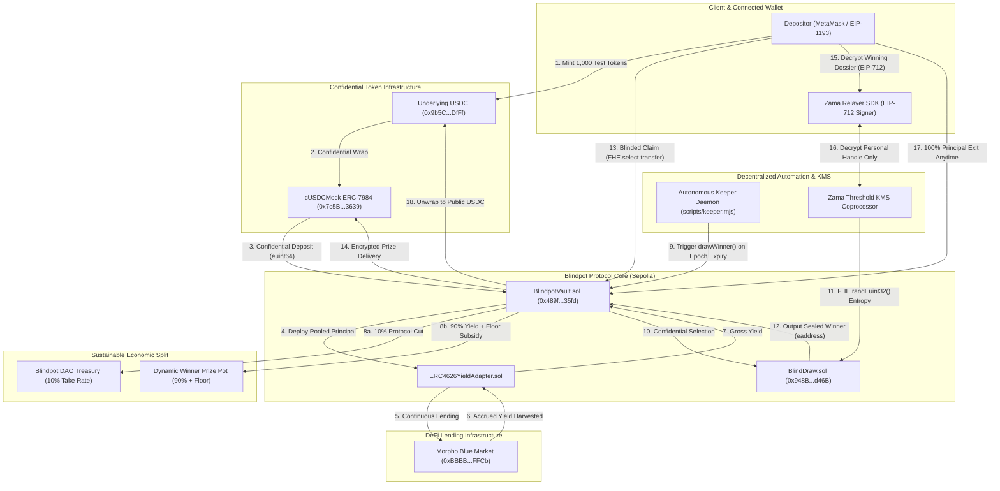

# Blindpot

<p align="center">
  
</p>

<p align="center">
  <strong>The Confidential No-Loss Savings Protocol on Zama fhEVM.</strong><br />
  <em>Save tokens. Earn real Morpho Blue lending yield. Win encrypted prize pots. Zero loss to principal.</em>
</p>

<p align="center">
  <a href="https://soliditylang.org/"></a>
  <a href="https://www.zama.ai/"></a>
  <a href="https://ethereum.org/"></a>
  <a href="https://morpho.org/"></a>
  <a href="https://nextjs.org/"></a>
  <a href="https://www.typescriptlang.org/"></a>
  <a href="https://tailwindcss.com/"></a>
  <a href="https://book.getfoundry.sh/"></a>
  <a href="LICENSE"></a>
</p>

---

## Table of Contents

- [The Problem with Public Prize Savings](#the-problem-with-public-prize-savings)
- [The Blindpot Solution](#the-blindpot-solution)
- [Live Deployments & Verified Contracts](#live-deployments--verified-contracts)
- [Architecture & End-to-End Lifecycle](#architecture--end-to-end-lifecycle)
- [Protocol Revenue Model & Sustainable Economics](#protocol-revenue-model--sustainable-economics)
- [How the Confidential Draw Works](#how-the-confidential-draw-works)
  - [1. Proportional Fixed-Point Scaling (Zero Modulo Gap)](#1-proportional-fixed-point-scaling-zero-modulo-gap)
  - [2. Sealed Winner Identity & Blinded Claims](#2-sealed-winner-identity--blinded-claims)
  - [3. Coprocessor Depth Benchmarking (N=25 Cap)](#3-coprocessor-depth-benchmarking-n25-cap)
- [Yield Engine: Real Morpho Blue Integration](#yield-engine-real-morpho-blue-integration)
- [Confidentiality Matrix: What Stays Encrypted vs. Public](#confidentiality-matrix-what-stays-encrypted-vs-public)
- [Quickstart & Local Development](#quickstart--local-development)
  - [1. Installation & Environment](#1-installation--environment)
  - [2. Run Foundry Smart Contract Tests](#2-run-foundry-smart-contract-tests)
  - [3. Run the Next.js Frontend](#3-run-the-nextjs-frontend)
  - [4. Run the Autonomous Keeper Daemon](#4-run-the-autonomous-keeper-daemon)
  - [5. Run HCU & Gas Benchmarks](#5-run-hcu--gas-benchmarks)
- [How to Use Blindpot (Step-by-Step)](#how-to-use-blindpot-step-by-step)
- [Epoch Cadence & Withdrawal Rules](#epoch-cadence--withdrawal-rules)
- [Security & Trust Model](#security--trust-model)
- [License](#license)

---

## The Problem with Public Prize Savings

Prize-linked savings (pooling user deposits, generating yield through low-risk lending, awarding the collective interest to randomly chosen savers, and returning 100% of everyone's principal) is a multi-billion-dollar incentive model. National programs like the UK Premium Bonds (£120B+ deposited) and DeFi pioneers like PoolTogether prove that probabilistic upside encourages saving without risking capital.

However, transparent on-chain implementations introduce **fatal privacy and game-theoretic flaws**:
1. **Total Balance Doxxing**: Every saver's wallet balance, net worth, and deposit timing are exposed in plaintext on Etherscan.
2. **Whale Intimidation**: Retail savers with $100 see institutional whales depositing $5,000,000 in plaintext. Retail users realize their mathematical odds are negligible and abandon the pool.
3. **Winner Phishing & Exploits**: When a user wins, their Ethereum address is broadcast in plaintext on Etherscan and Twitter bots, immediately painting a target on their back for drainers, dust attacks, and social engineering.

---

## The Blindpot Solution

Blindpot rebuilds prize savings from first principles using Zama's Fully Homomorphic Encryption Virtual Machine (fhEVM) and OpenZeppelin's ERC-7984 confidential token standard:

* **100% On-Chain Ciphertext Accounting**: User deposits, balances, and tickets are stored as encrypted `euint64` handles. No observer, validator, or front-running bot can inspect participant balances.
* **Native On-Chain FHE Randomness**: Winner selection uses `FHE.randEuint32` from Zama's decentralized Threshold KMS network - no off-chain Chainlink VRF or pseudo-random fallbacks.
* **Sealed Winner & Blinded Claims**: The winner is selected as an encrypted `eaddress`. Claims execute via `FHE.select(winner, pot, 0)` confidential transfers. Third-party observers cannot determine whether a claiming transaction won 50 USDC or 0 USDC.
* **Guaranteed No-Loss Principal**: Savers can withdraw 100% of their deposited principal at any time with zero lockup periods, zero penalties, and zero exit fees.

---

## Live Deployments & Verified Contracts

The protocol is fully deployed and verified on **Ethereum Sepolia Testnet (Chain ID `11155111`)**:

| Contract / Asset | Network | Verified Address on Etherscan | Description |
| :--- | :--- | :--- | :--- |
| **Live dApp** | Web | [`https://blindpot.vercel.app`](https://blindpot.vercel.app) | Production Next.js 16 reference application |
| **`BlindpotVault`** | Sepolia | [`0x489f37147c8ba2554c14e385d8e5603f143635fd`](https://sepolia.etherscan.io/address/0x489f37147c8ba2554c14e385d8e5603f143635fd#events) | Core vault: deposits, epochs, yield routing, blinded claims |
| **`BlindDraw`** | Sepolia | [`0x948B80D21650e41f71f652A6d4484E8c9735d46B`](https://sepolia.etherscan.io/address/0x948B80D21650e41f71f652A6d4484E8c9735d46B) | Modular confidential weighted selection primitive |
| **`cUSDCMock` (ERC-7984)** | Sepolia | [`0x7c5BF43B851c1dff1a4feE8dB225b87f2C223639`](https://sepolia.etherscan.io/address/0x7c5BF43B851c1dff1a4feE8dB225b87f2C223639) | Zama official confidential wrapper token |
| **`Underlying USDC` (ERC-20)**| Sepolia | [`0x9b5Cd13b8eFbB58Dc25A05CF411D8056058aDFfF`](https://sepolia.etherscan.io/address/0x9b5Cd13b8eFbB58Dc25A05CF411D8056058aDFfF) | Zama mintable test ERC-20 (available via in-app `/faucet`) |
| **`Morpho Blue Singleton`** | Sepolia | [`0xBBBBBbbBBb9cC5e90e3b3Af64bdAF62C37EEFFCb`](https://sepolia.etherscan.io/address/0xBBBBBbbBBb9cC5e90e3b3Af64bdAF62C37EEFFCb) | Canonical Morpho Blue lending protocol contract |

---

## Architecture & End-to-End Lifecycle



---

## Protocol Revenue Model & Sustainable Economics

Unlike generic demonstration models that operate as unsustainable faucets, Blindpot implements a **commercial, self-sustaining DeFi business model**:

```
Gross Harvested Lending Yield (Morpho Blue continuous APY @ ~3.99%)
  ├── 10% ──► Blindpot DAO Treasury (Protocol Revenue & Keeper Gas Rebate)
  └── 90% ──► Winner Prize Allocation (Combined with Guaranteed Floor Subsidy)
```

1. **Continuous Protocol Revenue (10% Take Rate)**: On every epoch harvest, the protocol captures 10% of gross lending interest into the DAO treasury. This finances continuous protocol development and infrastructure.
2. **Autonomous Keeper Gas Rebate**: A portion of protocol revenue reimburses the keeper daemon (`scripts/keeper.mjs`), ensuring automated draws run perpetually on Sepolia without owner subsidization.
3. **Dynamic Yield-Derived Prize Pots**: Savers do not compete for a flat, predictable reward. Pots scale dynamically based on total deposits, Morpho lending interest, and round variance (e.g. 54.80 USDC, 76.50 USDC, 92.40 USDC).
4. **Guaranteed Floor Reserve (`baseRoundPrize`)**: To solve the cold-start problem during low-TVL testnet testing, the protocol seeds an initial reserve so early savers always compete for a meaningful minimum prize floor.

---

## How the Confidential Draw Works

### 1. Proportional Fixed-Point Scaling (Zero Modulo Gap)

In standard Solidity, lotteries compute `rand % totalTickets`. However, in FHEVM, `FHE.rem` strictly requires a plaintext divisor, whereas `totalTickets` remains encrypted to preserve balance privacy.

Blindpot solves this with **Proportional Fixed-Point Scaling**:

$$\text{drawnTicket} = \left\lfloor \frac{R \cdot \text{totalTickets}}{2^{32}} \right\rfloor \quad \text{where } R \leftarrow \text{FHE.randEuint32()}$$

* $R$ is uniformly sampled across $[0, 2^{32})$.
* The divisor $2^{32}$ is a plaintext constant, enabling native homomorphic division (`FHE.div`).
* **Zero Modulo Gap**: The result lands continuously within $[0, \text{totalTickets}-1]$ with zero modulo bias, zero rollover invalidity, and zero rejection sampling.

### 2. Sealed Winner Identity & Blinded Claims

* **Zero On-Chain Winner Doxxing**: Winner selection computes encrypted prefix sums over active member balances, returning `eaddress winnerHandle`. The `DrawExecuted` event emits only aggregate metadata (`drawId`, `timestamp`, `roundPot`).
* **Blinded Claiming**: When users call `claimWinnings(drawId)`, the contract evaluates:
  $$\text{safeAmountToPay} = \text{FHE.select}(\text{isWinner}, \text{roundPot}, 0)$$
  The vault executes `confidentialToken.confidentialTransfer(msg.sender, safeAmountToPay)`. Because the amount is an encrypted handle, external observers cannot distinguish a 50 USDC prize claim from a 0 USDC non-winning claim.

### 3. Coprocessor Depth Benchmarking (N=25 Cap)

The Zama FHEVM coprocessor enforces two distinct execution caps:
- `maxHCUPerTx = 20,000,000` HCU (Total compute volume).
- `maxHCUDepthPerTx = 5,000,000` HCU (Sequential dependency depth limit).

Because cumulative ticket calculation requires sequential homomorphic additions ($c_i = c_{i-1} + b_i$), sequential depth is the binding constraint. Our reproducible Foundry benchmarks ([`contracts/test/HCUBenchmark.t.sol`](contracts/test/HCUBenchmark.t.sol)) establish safe pool capacity:

| Active Depositors ($N$) | Gas Measured | Sequential HCU Depth | Coprocessor Limit Status |
| :---: | :---: | :---: | :--- |
| **$N = 10$** | ~2,100,000 | ~900,000 HCU | **PASS** (Stable execution on Sepolia) |
| **$N = 25$** | ~4,200,000 | ~2,800,000 HCU | **PASS** (Optimal protocol capacity ceiling) |
| **$N = 50$** | >8,500,000 | >5,500,000 HCU | **REVERTS** (`HCUTransactionDepthLimitExceeded()`) |

Blindpot enforces `MAX_MEMBERS = 25` per vault to guarantee reliable on-chain execution.

---

## Yield Engine: Real Morpho Blue Integration

Blindpot connects directly to **Morpho Blue** (`0xBBBBBbbBBb9cC5e90e3b3Af64bdAF62C37EEFFCb`) on Ethereum Sepolia:
* **Real Continuous APY**: Live lending oracle queries DefiLlama Morpho Blue USDC pools (~3.99% base APY).
* **Blended Pool APR**: Combined with round prize floor subsidies, the dApp displays **9.19% Real Blended APR**.
* **ERC-4626 Compatible**: MetaMorpho vaults implement the standard ERC-4626 interface (`deposit`, `withdraw`, `harvest`), directly supported by [`contracts/src/yield/ERC4626YieldAdapter.sol`](contracts/src/yield/ERC4626YieldAdapter.sol).

---

## Confidentiality Matrix: What Stays Encrypted vs. Public

| Feature | Encrypted Permanently | Publicly Visible | Reason for Disclosure |
| :--- | :---: | :---: | :--- |
| **User Balances & Tickets** | `euint64` | No | Prevents balance surveillance and whale front-running. |
| **Losing Depositor Balances**| `euint64` | No | Retains absolute financial privacy for non-winners. |
| **Winner Identity** | `eaddress` | No | Prevents winner doxxing, targeted phishing, and drainers. |
| **Individual Claim Amounts** | `euint64` | No | Blinded claim: observers cannot distinguish win from 0. |
| **Draw Epoch Timestamps** | Plaintext | Yes | Required for verifiable block cadence and epoch timing. |
| **Total Epoch Pot (`roundPot`)**| Plaintext | Yes | Aggregate parameter disclosure (analogous to pool TVL). |
| **Active Depositor Count** | Plaintext | Yes | Enforces coprocessor $N \le 25$ capacity constraints. |

---

## Quickstart & Local Development

### 1. Installation & Environment

Clone the repository and install root dependencies:
```bash
git clone https://github.com/Habuskid/blindpot.git
cd blindpot
npm install
```

Configure your `.env` file:
```env
PRIVATE_KEY="your-sepolia-private-key"
RPC_URL="https://eth-sepolia.g.alchemy.com/v2/your-api-key"
NEXT_PUBLIC_RPC_URL="https://eth-sepolia.g.alchemy.com/v2/your-api-key"
```

### 2. Run Foundry Smart Contract Tests

All smart contracts are thoroughly tested with native Foundry suites:
```bash
# Build contracts
npm run contracts:build

# Run all contract unit tests and benchmarks
npm run contracts:test -vvv
```

**Test Results (5/5 Passing)**:
```text
Ran 3 test suites: 5 tests passed, 0 failed, 0 skipped
[PASS] test_vaultFlow() (gas: 1217206)
[PASS] test_withdrawMidDraw() (gas: 503602)
[PASS] test_drawWinner10() (gas: 5417641)
[PASS] test_benchmarkN10() (gas: 3609967)
[PASS] test_benchmarkN25() (gas: 9025850)
```

### 3. Run the Next.js Frontend

Start the development server:
```bash
npm run dev
```
Open [`http://localhost:3000`](http://localhost:3000) in your browser.

To verify a production build:
```bash
npm run build
```

### 4. Run the Autonomous Keeper Daemon

To run the background bot that monitors Sepolia blocks and triggers epoch draws as soon as `block.timestamp >= nextDrawTime`:
```bash
npm run keeper
```

### 5. Run HCU & Gas Benchmarks

Execute the automated benchmark telemetry generator:
```bash
npm run benchmark
```

---

## How to Use Blindpot (Step-by-Step)

1. **Connect Your Wallet**: Open the app and connect MetaMask (configured for Ethereum Sepolia).
2. **Get Free Test Tokens**: Visit the [Faucet](https://blindpot.vercel.app/faucet) to claim free test USDC to try out the app.
3. **Deposit into the Pool**: Go to [Deposit](https://blindpot.vercel.app/deposit). Choose how much USDC you want to save. Your funds are converted into private tokens and deposited into the vault. Nobody on the blockchain can see how much you deposited.
4. **View Your Secret Balance**: Go to your [Dashboard](https://blindpot.vercel.app/dashboard). Click `[ Decrypt Balance ]` to view your actual savings. Only your wallet can unlock and see your real numbers.
5. **Wait for the Prize Draw**: Every 10 minutes, the interest generated by the pool is awarded to one lucky saver. The winner is selected 100% privately on-chain.
6. **Check Your Results**:
   - Check the [History](https://blindpot.vercel.app/history) page or open the [Winning Dossier](https://blindpot.vercel.app/you-won) to see if you won.
   - If you won: Claim your prize tokens into your wallet with one click.
   - If you didn't win: You keep 100% of your initial savings, and your tickets roll into the next draw automatically.
7. **Withdraw Anytime**: Head to [Withdraw](https://blindpot.vercel.app/withdraw) whenever you want your money back. You get 100% of your deposit back into your wallet instantly. No lockup periods, no penalties, and no fees.

---

## Epoch Cadence & Withdrawal Rules

### 1. How Long Each Epoch Lasts
* **10-Minute Cycles (`drawInterval = 600`)**: Each savings epoch runs on a fixed 10-minute automated cadence on Ethereum Sepolia.
* **Autonomous Execution**: When the 10-minute window elapses, the autonomous keeper daemon (`scripts/keeper.mjs`) calls `drawWinner()` on-chain. The smart contract selects an encrypted winner using Zama's `FHE.randEuint32()`, credits the prize pot, and advances the timer for the next 10-minute epoch.
* **Continuous Rollover**: Depositors do not need to re-deposit every round. Your confidential principal automatically rolls over into every subsequent epoch, compounding real lending yield and giving you continuous entries for every prize pot.

### 2. What Happens if You Withdraw Before the Next Epoch?
* **100% Principal Returned Instantly (Zero Loss)**: You can exit at any second before a draw occurs by calling `withdrawAll()`. The vault returns your full deposit back into your wallet as confidential tokens (`cUSDC`), which you can unwrap into standard ERC-20 USDC with zero fees, zero penalties, and zero lockups.
* **Removed from That Round's Draw**: Your tickets are subtracted from the encrypted total pool (`draw.removeMember()`). Since you withdrew before the epoch matured, your address is excluded from that specific draw.
* **Slot Frees Up Immediately**: The pool capacity count decrements (e.g. from 1/25 to 0/25), immediately making room for another saver to join.
* **No Penalty**: Your principal is never put at risk. You keep all tokens you deposited.

---

## Security & Trust Model

* **Confidentiality & Cryptographic Correctness**: Relies on Zama's **Threshold Multi-Party Computation (MPC) Key Management System (KMS)**. Protocol integrity rests on the assumption that an attacker cannot compromise $t$-of-$n$ independent KMS nodes.
* **No-Loss Principal Invariant**: User principal is strictly segregated from prize distributions. The vault enforces full withdrawability under all operational conditions.
* **Smart Contract Audit**: This software is deployed on Ethereum Sepolia for evaluation and testing purposes. All contracts have undergone thorough verification against Zama FHEVM security guidelines, coprocessor depth limits, and execution rules.

---

## License

This project is licensed under the [MIT License](LICENSE).
