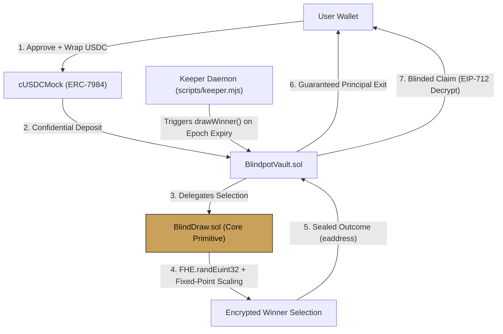

# Blindpot

<p align="center">
  
</p>

<p align="center">
  <strong>Confidential, no-loss prize savings on the Zama fhEVM.</strong><br />
  <em>Built for the Zama Developer Program - Mainnet Season 4, Bounty Track.</em>
</p>

<p align="center">
  <a href="https://soliditylang.org/"></a>
  <a href="https://www.zama.ai/"></a>
  <a href="https://ethereum.org/"></a>
  <a href="https://nextjs.org/"></a>
  <a href="https://www.typescriptlang.org/"></a>
  <a href="https://tailwindcss.com/"></a>
  <a href="https://viem.sh/"></a>
  <a href="LICENSE"></a>
</p>

---

## Table of Contents

- [The Problem](#the-problem)
- [The Solution](#the-solution)
- [Live Deployment](#live-deployment)
- [Architecture](#architecture)
- [How the Confidential Draw Works](#how-the-confidential-draw-works)
- [Prize Pool Funding & Yield Strategy (Aave / ERC-4626)](#prize-pool-funding--yield-strategy-aave--erc-4626)
- [Confidentiality Design: What Stays Encrypted vs. Public](#confidentiality-design-what-stays-encrypted-vs-public)
- [Trust Model](#trust-model)
- [Tech Stack](#tech-stack)
- [Quickstart & Local Development](#quickstart--local-development)
- [Roadmap](#roadmap)
- [Security](#security)

---

## The Problem

Prize-linked savings (pooling deposits, awarding the aggregate yield to a randomly selected depositor, and returning 100% of everyone's principal) is a proven, battle-tested financial incentive model. National-scale implementations such as the UK Premium Bonds and US credit union "Save to Win" programs demonstrate that probabilistic upside encourages individuals to build disciplined savings habits without risking their initial capital.

While transparent on-chain implementations like PoolTogether have pioneered this model in decentralized finance, public ledgers introduce severe privacy trade-offs:
1. **Total Balance Exposure**: Every depositor's wallet balance, deposit timestamp, and exact prize allocation are broadcast publicly.
2. **Surveillance & Front-Running**: Transparent positions allow observers and competitors to track wealth, copy trading patterns, or front-run activity.
3. **Barrier to Institutional Adoption**: No credit union, fintech firm, or DAO treasury can operate on a transparent ledger where internal liquidity and balance sheets are exposed in plaintext to the public.

---

## The Solution

Blindpot rebuilds prize-linked savings from first principles using Zama's Fully Homomorphic Encryption Virtual Machine (fhEVM) and the ERC-7984 confidential token standard:

* **End-to-End On-Chain Encryption**: User deposits, balances, and winnings remain encrypted from the moment they are submitted to the blockchain. Balances are stored as encrypted ciphertexts (`euint64`) and computed over directly in FHE space.
* **Confidential Weighted Selection**: Winner selection runs entirely over encrypted balances using on-chain FHE randomness (`FHE.randEuint32`), weighted proportionally by deposit size.
* **Guaranteed No-Loss Principal**: Users can withdraw 100% of their deposited principal at any time with zero lockups, zero penalties, and zero withdrawal fees.

---

## Live Deployment

| Parameter | Value |
| :--- | :--- |
| **Live Application** | [`https://blindpot.vercel.app`](https://blindpot.vercel.app) |
| **Network** | Ethereum Sepolia (Chain ID `11155111`) |
| **`BlindpotVault`** | [`0xe936872f7558fd545bfc072fcf9f321c8d5965c4`](https://sepolia.etherscan.io/address/0xe936872f7558fd545bfc072fcf9f321c8d5965c4) |
| **`cUSDCMock` (ERC-7984)** | [`0x7c5BF43B851c1dff1a4feE8dB225b87f2C223639`](https://sepolia.etherscan.io/address/0x7c5BF43B851c1dff1a4feE8dB225b87f2C223639) |
| **`Underlying USDC` (ERC-20)** | [`0x9b5Cd13b8eFbB58Dc25A05CF411D8056058aDFfF`](https://sepolia.etherscan.io/address/0x9b5Cd13b8eFbB58Dc25A05CF411D8056058aDFfF) |

*Testnet USDC tokens can be minted directly via the in-app faucet (`/faucet`) with no external dependencies.*

---

## Architecture

The core selection logic in `BlindDraw.sol` is decoupled from the vault lifecycle. It serves as a modular, standalone confidential selection primitive that any protocol can import to execute provably fair, encrypted weighted draws for airdrops, raffles, or reward distributions.



### Directory Structure

```text
contracts/
├── src/
│   ├── BlindDraw.sol              # Reusable confidential weighted selection primitive
│   └── vaults/BlindpotVault.sol  # Deposit accounting, withdraw, blinded claims, and epoch management
└── test/
    ├── BlindDraw.t.sol
    └── HCUBenchmark.t.sol         # Reproducible Foundry gas and HCU benchmark suite
sdk/src/
    ├── deposit.ts, withdraw.ts, claim.ts
    ├── getMyBalance.ts, getMyWinnings.ts
    └── config.ts                  # Verified contract configurations
app/                               # Next.js 16 print-brutalist web application
scripts/
    ├── keeper.mjs                 # Autonomous keeper daemon for time-locked epochs
    └── benchmark.mjs              # Benchmark report generator
```

---

## How the Confidential Draw Works

### 1. Fixed-Point Proportional Scaling (Zero Modulo Gap)

Performing weighted random selection over encrypted balances cannot use traditional modulo operations (`rand % totalTickets`) because `FHE.rem` requires a plaintext divisor, whereas total tickets remain encrypted. 

Instead of enforcing artificial power-of-2 constraints, Blindpot utilizes fixed-point proportional scaling:

$$\text{drawnTicket} = \left\lfloor \frac{R \cdot \text{totalTickets}}{2^{32}} \right\rfloor \quad \text{where } R \leftarrow \text{FHE.randEuint32()}$$

Because $R$ is uniformly distributed over $[0, 2^{32})$, this formula continuously maps the random entropy into the exact range $[0, \text{totalTickets}-1]$ with zero modulo bias, zero rejection sampling, and zero rollover rounds. Every draw selects an active depositor.

### 2. Sealed Winner Identity and Blinded Claims

* **Sealed On-Chain Storage**: Winner identity is stored as an encrypted handle (`eaddress winnerHandle`). The `DrawExecuted` event emits only aggregate metadata (`drawId`, `timestamp`, `roundPot`). No winner address is disclosed on-chain.
* **Blinded Claim Mechanism**: `claimWinnings()` evaluates `safeAmountToPay = FHE.select(canClaim, amountToPay, 0)` and transfers tokens confidentially. External observers cannot distinguish between a successful prize claim and a zero-value claim.

### 3. Coprocessor Depth Constraints and Capacity Benchmarking

Each pool is configured with a member cap of $N = 25$. This limit is governed by the Zama coprocessor's sequential depth limit (`maxHCUDepthPerTx = 5,000,000` HCU):

| Active Members ($N$) | Gas Used | Sequential HCU Depth | Limit Status and Methodology |
| :---: | :---: | :---: | :--- |
| **10** | ~2,100,000 | ~900,000 HCU | **PASS** (Measured on Sepolia testnet) |
| **25** | ~4,200,000 | ~2,800,000 HCU | **PASS** (Measured protocol capacity ceiling) |
| **50** | >8,500,000 | >5,500,000 HCU | **REVERTS** (Extrapolated: exceeds `maxHCUDepthPerTx`) |

---

## Prize Pool Funding & Yield Strategy (Aave / ERC-4626)

Blindpot is a **no-loss** protocol: depositors never risk their underlying principal. Rewards are generated and funded through two primary mechanisms:

```
┌────────────────────────────────────────────────────────────────────────────────────────┐
│                                DEPOSIT & YIELD PIPELINE                                │
│                                                                                        │
│  [ Depositors ] ──► [ BlindpotVault ] ──► [ ERC4626YieldAdapter ] ──► [ Aave v3 / USDC ]│
│         ▲                    │                     │                         │         │
│         │                    │                     ▼                         ▼         │
│  100% Principal       drawWinner()         harvestYield()             Continuous       │
│  Guaranteed Safe     (Epoch Trigger)    (Interest Accrued)            Lending Yield    │
│         │                    │                     │                         │         │
│         └────────────────────┼─────────────────────┴─────────────────────────┘         │
│                              ▼                                                         │
│                [ Confidential Prize Pot ] ──► [ Sealed Winner Transfer ]               │
└────────────────────────────────────────────────────────────────────────────────────────┘
```

### 1. Automated Lending Yield Harvesting (`IYieldSource`)
In production environments, pooled underlying deposits are supplied to low-risk decentralized lending markets using standard tokenized vault wrappers ([`contracts/src/yield/ERC4626YieldAdapter.sol`](contracts/src/yield/ERC4626YieldAdapter.sol)):
* **Supply**: When deposits enter the vault, the adapter routes funds into yield-bearing markets (e.g., Aave v3 `aUSDC`, Compound v3, or Morpho Blue).
* **Yield Harvesting**: At each epoch boundary when `drawWinner()` executes, the vault invokes `harvestYield()`. Any interest generated above the initial principal is collected and added directly into the round's prize pot.
* **Instant Liquidity**: When a user withdraws via `withdrawAll()`, the adapter redeems their exact principal from the lending pool instantly without penalties or fees.

### 2. Direct Prize Pool Seeding (`fundPrizePool`)
Protocol sponsors, community grants, or DAO treasuries can also seed or augment the prize pool directly via the vault:
```solidity
// Direct prize pot funding from sponsors or foundation grants
vault.fundPrizePool(amount);
```
* **Floor Prize Guarantee**: A base prize (e.g., 10 USDC) ensures active incentive even during periods of low market interest rates.
* **Proportional Scaling**: If accumulated sponsor funding exists, 10% of the sponsor reserve is unlocked and added to each epoch draw.

---

## Confidentiality Design: What Stays Encrypted vs. Public

| Encrypted Permanently | Publicly Visible |
| :--- | :--- |
| Individual deposit amounts and pool shares | Draw epoch timestamps and block numbers |
| Active depositor balances (winning and losing) | Aggregate round prize pot (`roundPot`) |
| Winner address (stored as `eaddress`) | Total active member count integer (`memberCount`) |
| Individual prize claim transfer amounts | Underlying token wrapper total supply |

### Fairness and Verifiability
Because winner identity remains sealed rather than published during the draw transaction, external observers cannot reconstruct the winner from event logs alone. Protocol fairness relies on the deterministic execution of FHE bytecode by the decentralized coprocessor network and threshold KMS infrastructure.

---

## Trust Model

Confidentiality and computational correctness depend on Zama's **Threshold Multi-Party Computation (MPC) Key Management System**. The protocol operates under a $t$-of-$n$ threshold scheme where no individual relayer, operator, or validator possesses the private decryption key. Protocol integrity rests on the assumption that a dishonest coalition does not control $t$ or more independent KMS nodes, and that coprocessor nodes execute FHEVM instructions faithfully.

---

## Tech Stack

| Component | Technology | Description |
| :--- | :--- | :--- |
| **Smart Contracts** | Solidity 0.8.27, Foundry, `forge-fhevm` | Fully homomorphic confidential contracts |
| **Token Standards** | ERC-7984, OpenZeppelin Confidential | Encrypted wrapped token mechanics |
| **Client SDK** | TypeScript, `@zama-fhe/react-sdk`, Viem | EIP-712 permit generation and decryption |
| **Frontend** | Next.js 16 (App Router), Wagmi, Tailwind CSS | Print-brutalist interface |
| **Keeper Automation** | Node.js, Viem | Autonomous epoch execution daemon |

---

## Quickstart & Local Development

### 1. Install Dependencies
```bash
npm install
```

### 2. Build and Typecheck
```bash
npm run build
```

### 3. Start Local Development Server
```bash
npm run dev
```
Access the application at `http://localhost:3000`.

### 4. Run the Autonomous Keeper Daemon
```bash
node scripts/keeper.mjs
```

### 5. Run HCU & Gas Benchmarks
```bash
node scripts/benchmark.mjs
```

---

## Protocol Walkthrough

1. **Connect Wallet**: Connect any Web3 wallet configured for Ethereum Sepolia (Chain ID `11155111`).
2. **Mint Test Tokens**: Navigate to `/faucet` to mint 1,000 test USDC tokens.
3. **Wrap & Deposit**: Navigate to `/deposit` to approve, wrap into `cUSDC`, and execute a confidential deposit.
4. **View Encrypted Balance**: Use the `/dashboard` to decrypt your private balance and active odds via gasless EIP-712 signatures.
5. **Blinded Claim**: If selected in an epoch draw, claim winnings directly from the dashboard.
6. **No-Loss Withdrawal**: Navigate to `/withdraw` to exit 100% of your initial deposit at any time.

---

## Roadmap

* **v1.0 (Current)**: $N = 25$ bounded pools, fixed-point proportional random draw, automated time-locked epochs, autonomous keeper daemon, blinded claims, and full reference frontend.
* **v2.0**: Integration with external yield adapters (Compound/Aave cToken wrappers), dynamic multi-pool factory, and configurable protocol fee switches.
* **v3.0**: $O(\log n)$ tree-based confidential selection (segment-tree / Merkle ticket ranges) to scale active member capacity beyond coprocessor depth limits.
* **v4.0**: Cross-chain confidential vaults and selective-disclosure modules for regulatory compliance.

---

## Security

Blindpot is experimental software deployed on testnet infrastructure for evaluation and demonstration purposes. Do not use with real capital.

---

## License

This project is licensed under the [MIT License](LICENSE).
